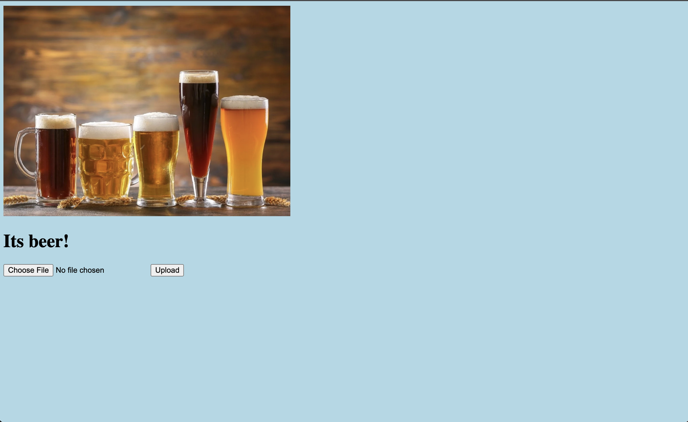

Beer-Detector

See if an image contains beer!

Link to project: https://beer-helper.cyclic.app/

How It's Made: Tech used: EJS, CSS, JavaScript, Node.js, Express.js

Optimizations: Would like to eventually be able to tell what type/color of beer it is!

Lessons Learned: How to utilize machine learning technology!
